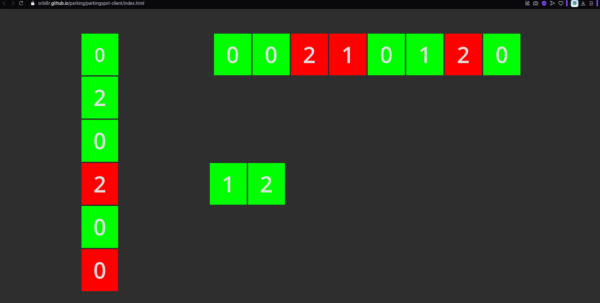
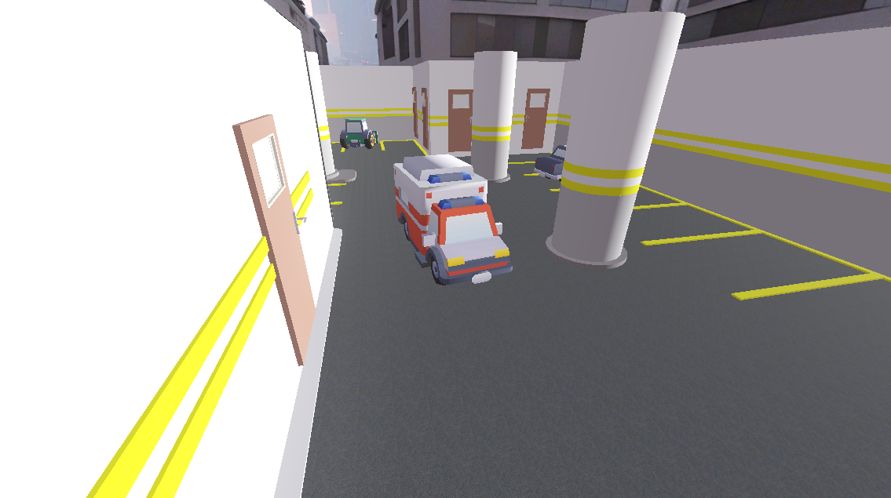
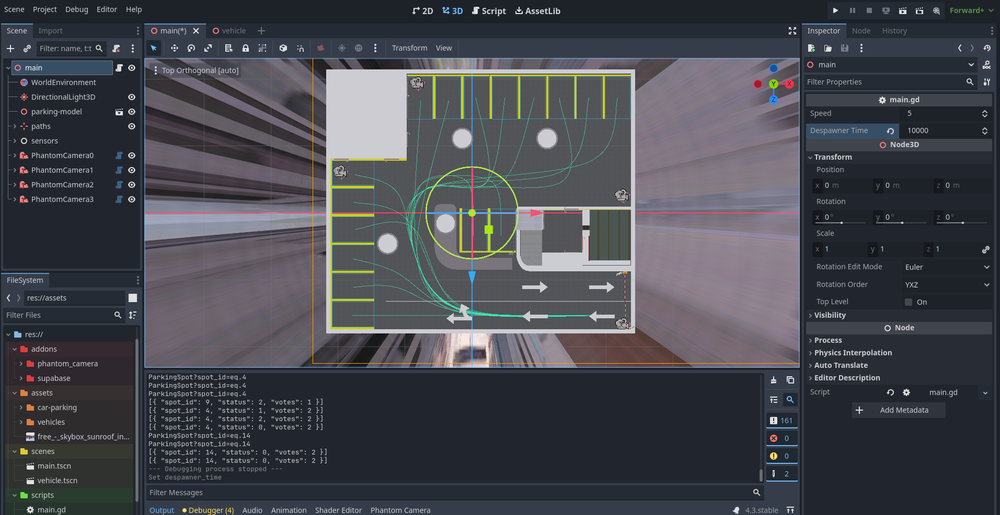
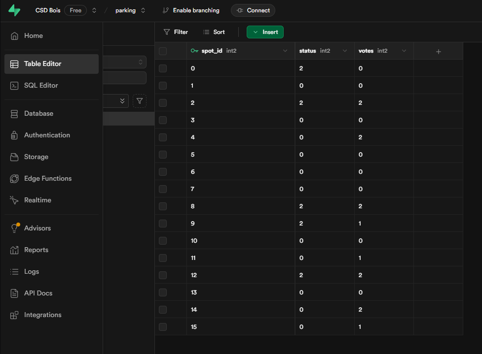
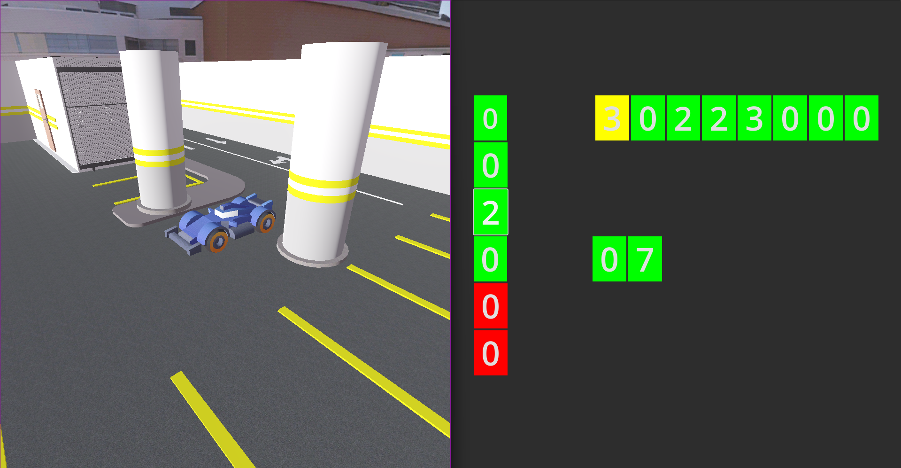

# Parking

This project is a Class Activity for the Intro to IoT course at IIITH by CSD Bois. It demonstrates a complete parking management solution with mobile clients, a simulated parking lot, and sensor integrations. [GithubWebLink](https://orbi8r.github.io/parking/)

## Table of Contents
- [Overview](#overview)
- [Architecture](#architecture)
- [Technologies Used](#technologies-used)
- [Screenshots](#screenshots)
- [Mobile Webpage](#mobile-webpage)

## Overview

The system integrates mobile clients with a simulated parking lot in Godot. Mobile users can reserve parking spots via a web application. Once a spot is reserved, the car drives to that parking spot. The parking lot uses IR sensors connected to a central server, which communicates with Supabase via authenticated REST signals. Supabase validates the user's parking spot choice using PostgreSQL and edge functions.

## Architecture

Below is a diagram of the system architecture:

```mermaid
graph TD
    A[Mobile Clients<br>(Webapp)] -- "REST API & MQTT Subscription" --> B[Supabase<br>(Edge Functions)]
    B -- "Validated Parking Spot Reservation" --> C[PostgreSQL Database]
    D[IR Sensors<br>(Parking Lot)] -- "Authenticated REST Signals" --> B
    E[Godot Simulation<br>(Parking Lot)] -- "Real-time Status" --> B
    A -- "View Vacant/Occupied Spots" --> B
```

## Technologies Used

- **Godot v4.3** – Used to simulate the parking lot.
- **Supabase** – Backend Cloud based for authentication and real-time updates.
- **PostgreSQL** – Database for storing parking spot details and user data.
- **REST API (HTTPS)** – Communication channel for mobile client and sensor interactions.
- **MQTT API (Websockets)** – Real-time subscription for parking spot status updates.

## Screenshots

### Mobile Web Application


### Parking Lot Simulation



### Sensor and Database Integration



## Mobile Webpage
The mobile and desktop webpage is hosted at: [https://orbi8r.github.io/parking/](https://orbi8r.github.io/parking/)
